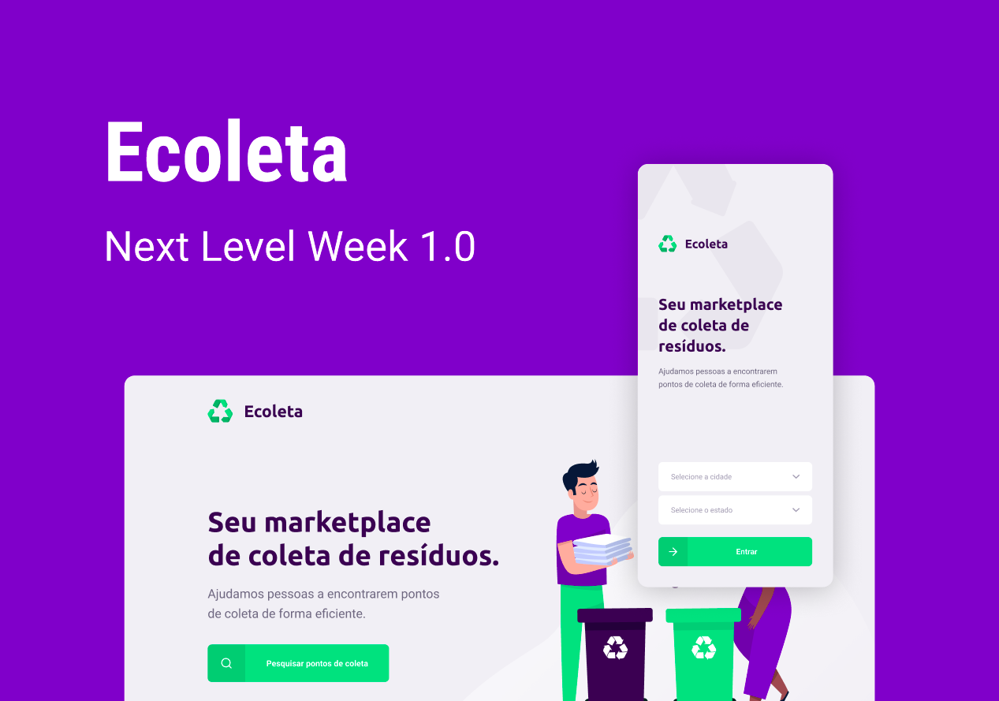

<h1 align="center">
  Next Level Week #01
</h1>

<p align="center">
  
</p>

<h2 align="center">Ecoleta</h2>

<p align="center">
  <a href="https://www.linkedin.com/in/pablonora/">
    
  </a>

  <a href="https://github.com/pablonora/nlw-01/commits/master">
    
  </a>

  <a href="https://github.com/pablonora/nlw-01/blob/master/LICENSE">
    
  </a>

  <a href="https://github.com/pablonora/nlw-01/stargazers">
    
  </a>
</p>

# Sobre este respositório

A Next Level Week é uma semana realizada pela [RocketSeat](https://rocketseat.com.br/). Durante a semana (seg-sex) são ensinados, através de cinco vídeo aulas, além de lives com conteúdos bônus, ferramentas para desenvolvimento web, servidor e móvel.
O projeto escolhido para ser ensinado durante a semana foi focado no meio ambiente.

## O projeto

O projeto, chamado Ecoleta, é um projeto desenvolvido basedo na semana internacional do meio ambiente. Possibilitando encontrar uma forma de conectar pessoas à empresas que coletam resíduos que não devem ser descartados no meio ambiente (Pilhas e baterias, óleo de cozinha etc...).

## As Tecnologias utilizadas

Em relação ao layout, foi utilizado o [Figma](https://www.figma.com/file/1SxgOMojOB2zYT0Mdk28lB/) para sua concepção.

Entre as tecnologias utilizadas na codificação estão:

- [Node.js][nodejs]
- [TypeScript][typescript]
- [React][react-js]
- [React Native][react-native]
- [Expo][expo]
- [Knex][knex]
- [Multer][multer]
- [Express][express]
- [SQLite][sqlite]

## Como rodar no seu computador

Para ter o conteúdo disponível no seu computador, você vai precisar ter instalado o [Git](https://git-scm.com) - para clonar diretamente - ou baixar o conteúdo deste repositório via arquivo compactado (zip). Depois disso, será preciso instalar o [Node.js][nodejs].

A partir disso é necessário seguir os passos abaixo:

### Com o GIT Instalado

Abra um terminal e digite:

```bash
$ git clone https://github.com/pablonora/nlw-01
$ cd nlw-01
```

### Sem o GIT Instalado

Extraia o arquivo compactado baixado e navegue até a pasta dele através do terminal utilizando o comando `cd `.

### Preparação do servidor

Para instalar o servidor que conecta-se com o banco de dados e disponibiliza os recursos da aplicação, insira os seguintes comandos:

```bash
$ cd nlw-01/server
$ npm instal
# Note que o comando anterior pode demorar um pouco dependendo da velocidade da sua conexão com à internet
$ npm knex:migrate
$ npm knex:seed
$ npm run dev
```

Não feche o terminal, pois o programa finalizará sua execução.

### Preparação da web

Para instalar o servidor que fornece as páginas web, abra um novo terminal e mova-se para o diretório principal da aplicação e insira os seguintes comandos:

```bash
$ cd nlw-01/web
$ npm install
# Note que o comando anterior pode demorar um pouco dependendo da velocidade da sua conexão com à internet
$ npm start
```

Não feche o terminal, pois o programa finalizará sua execução.

### Prepração do app para dispositivo móvel

Para instalar o app para dispositivo móvel, abra um novo terminal e mova-se para o diretório principal da aplicação e insira os seguintes comandos:

```bash
$ cd nlw-01/mobile
$ npm install
# Note que o comando anterior pode demorar um pouco dependendo da velocidade da sua conexão com à internet
# É necessário instalar também as seguintes fontes utilizadas no projeto, através do expo
$ expo install expo-font @expo-google-fonts/ubuntu @expo-google-fonts/roboto
$ npm start
```

Não feche o terminal, pois o programa finalizará sua execução.

Uma janela deve ser aberta no seu navegador com as informações para conectar-se a aplicação.

## Utilizando

Nas informações disponíveis na janela do navegador aberta através do comando anterior, para que seja possível conectar-se ao aplicativo, copie o endereço IP demonstrado no canto inferior esquerdo e substitua-o no arquivo `config.ts`. Neste mesmo arquivo é possível também alterar a porta na qual o servidor escuta pelas requisições. Os servidores devem reiniciar sozinhos após esta alteração.

Mesmo reiniciando sozinho, o servidor web precisará ser reiniciado manualmente para que o arquivo possa ser copiado para dentro do projeto. Aperte `ctrl-d` no terminal do servidor web e em seguida execute novamente o comando `npm start`.

Para acessar a página web, digite no seu browser o endereço IP e a porta configurada no arquivo de configuração.
Para acessar o aplicativo móvel, instale o aplicativo [Expo](https://play.google.com/store/apps/details?id=host.exp.exponent&hl=pt_BR) e escaneie o QRCode demonstrado na página. Caso não consiga, tente conectar-se diretamente através do endereço demonstrado na janela do navegador aberta no passo anterior.

## Licença

Como este projeto foi nos dado com carinho pela [RocketSeat](https://rocketseat.com.br/), ele também está disponível neste repositório gratuitamente para todos através da licença MIT. Detalhes: [LICENSE](https://github.com/pablonora/nlw-01/blob/master/LICENSE).


[nodejs]: https://nodejs.org/
[typescript]: https://www.typescriptlang.org/
[react-js]: https://reactjs.org
[react-native]: https://facebook.github.io/react-native/
[expo]: https://expo.io/
[knex]: http://knexjs.org/
[multer]: https://www.npmjs.com/package/multer
[express]: https://expressjs.com/pt-br/
[sqlite]: https://www.sqlite.org/index.html
